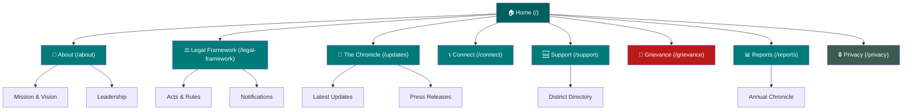
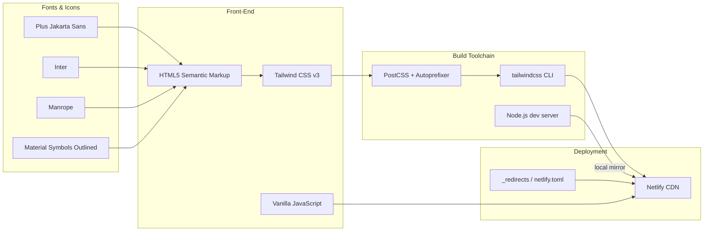
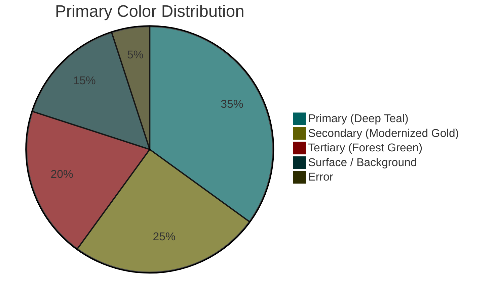
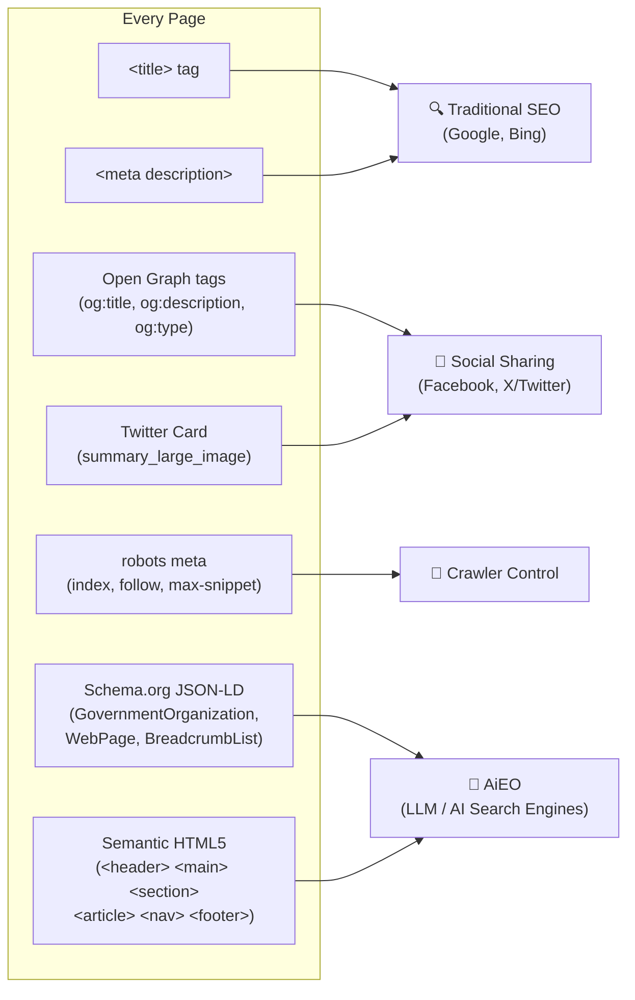
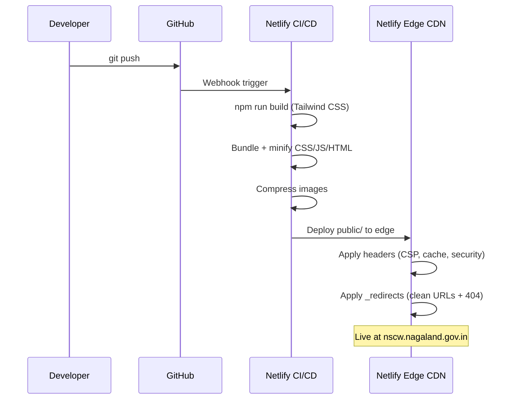

# Nagaland State Commission for Women — Web Experience

> **NSCW** · Documenting progress, defending rights, and curating the future of equity for women in Nagaland.

[](https://app.netlify.com/sites/your-site/deploys)


---

## Table of Contents

1. [Project Vision](#-project-vision)
2. [Live Site Architecture](#-live-site-architecture)
3. [Page Route Map](#-page-route-map)
4. [Tech Stack](#-tech-stack)
5. [Design System](#-design-system)
   - [Color Palette](#color-palette)
   - [Typography](#typography)
   - [Elevation & Surface Layers](#elevation--surface-layers)
6. [Repository Structure](#-repository-structure)
7. [SEO & AiEO Strategy](#-seo--aieo-strategy)
8. [Security Headers](#-security-headers)
9. [Getting Started](#-getting-started)
10. [NPM Scripts](#-npm-scripts)
11. [Deployment (Netlify)](#-deployment-netlify)
12. [Performance & Optimization](#-performance--optimization)
13. [License](#-license)

---

## 🏛️ Project Vision

The NSCW digital platform is built as a **High-End Editorial Narrative** experience — moving far beyond a conventional static government portal. It serves as an immersive digital chronicle that combines the visual language of premium editorial publishing with the rigor of official public-sector communication.

### Core Design Principles

| Principle | Description |
|---|---|
| **Editorial Narrative** | Storytelling-first information architecture; content flows like a curated publication. |
| **Digital Curator Aesthetic** | Intentional asymmetry, expansive negative space, sequential narrative progression. |
| **Glassmorphism UI** | Transparent sticky navigation with `backdrop-blur` for a sophisticated modern feel. |
| **AiEO-First** | Structured data and semantic HTML crafted to be consumed by LLM-powered search engines. |
| **Accessibility** | Responsive across mobile, tablet, and desktop; touch-friendly; WCAG-conscious contrast ratios. |

---

## 🗺️ Live Site Architecture

The following diagram shows the information architecture and user flow across the NSCW site:



---

## 🔗 Page Route Map

| Clean URL | Source File | Description |
|---|---|---|
| `/` | `public/Home.html` | Landing page — Empowering Women |
| `/about` | `public/About.html` | Mission, vision & leadership |
| `/legal-framework` | `public/Legal_Framework.html` | Acts, rules & notifications |
| `/updates` | `public/The_Chronicle.html` | Latest news & press releases |
| `/connect` | `public/Connect.html` | Contact & get in touch |
| `/support` | `public/Support.html` | District support directory |
| `/grievance` | `public/Grievance.html` | Report an issue |
| `/reports` | `public/Reports.html` | Annual reports & chronicles |
| `/privacy` | `public/Privacy.html` | Privacy policy |
| `/*` | `public/404.html` | Custom 404 error page |

> **Clean URL routing** is handled by `public/_redirects` (Netlify) and `public/.htaccess` (Apache), with the dev server (`scripts/dev_server.js`) mirroring the same mapping locally.

---

## 🚀 Tech Stack



| Layer | Technology | Version / Notes |
|---|---|---|
| Markup | HTML5 | Semantic tags: `<header>`, `<main>`, `<section>`, `<article>`, `<nav>`, `<footer>` |
| Styling | Tailwind CSS | `^3.4.19` — compiled via `npm run build` into `public/styles/tailwind.css` |
| CSS Plugins | `@tailwindcss/forms`, `@tailwindcss/container-queries` | Form resets + responsive container queries |
| PostCSS | autoprefixer | `^10.4.27` — vendor prefixes |
| Scripting | Vanilla JavaScript | No framework dependencies |
| Fonts | Google Fonts | Plus Jakarta Sans · Inter · Manrope |
| Icons | Material Symbols Outlined | Variable font (`FILL`, `wght`, `GRAD`, `opsz`) |
| Structured Data | Schema.org JSON-LD | `GovernmentOrganization`, `WebSite`, `WebPage`, `BreadcrumbList` |
| Deployment | Netlify | CDN edge deployment with asset compression & pretty URLs |

---

## 🎨 Design System

### Color Palette

The NSCW palette is derived from a **Material Design 3** tonal system anchored in Deep Teal and Modernized Gold.



| Token | Hex | Role |
|---|---|---|
| `primary` | `#00605f` | Primary actions, headlines, nav highlights |
| `primary-container` | `#007b7a` | Elevated primary surfaces |
| `primary-fixed` | `#96f2f0` | Fixed primary accents |
| `primary-fixed-dim` | `#7ad5d4` | Dimmed fixed accents, hover states |
| `inverse-primary` | `#7ad5d4` | Dark-mode primary |
| `on-primary` | `#ffffff` | Text/icon on primary surfaces |
| `on-primary-container` | `#b6fffd` | Text on primary container |
| `secondary` | `#795900` | Secondary actions, gold accents |
| `secondary-container` | `#fcc340` | Gold highlight chip backgrounds |
| `secondary-fixed` | `#ffdea0` | Soft gold surfaces |
| `secondary-fixed-dim` | `#f6be3b` | Dimmed gold, active borders |
| `on-secondary` | `#ffffff` | Text on secondary |
| `tertiary` | `#3d5c51` | Forest green decorative elements |
| `tertiary-container` | `#557469` | Tertiary surface containers |
| `surface` | `#fbf9f8` | Page background |
| `surface-container-low` | `#f6f3f2` | Card base |
| `surface-container` | `#f0eded` | Default card surface |
| `surface-container-high` | `#eae8e7` | Elevated card surface |
| `surface-container-highest` | `#e4e2e1` | Highest elevation surface |
| `on-surface` | `#1b1c1c` | Body text |
| `outline` | `#6e7979` | Borders, dividers |
| `outline-variant` | `#bdc9c8` | Subtle dividers |
| `error` | `#ba1a1a` | Destructive actions, alerts |

### Typography

| Role | Font Family | Weights Used | Usage |
|---|---|---|---|
| **Display / Headline** | Plus Jakarta Sans | 400 · 500 · 600 · 700 · 800 | Page titles, hero text, section headers |
| **Body** | Inter | 400 · 500 · 600 | Paragraphs, descriptions, UI labels |
| **Label / Metadata** | Manrope | 600 · 700 · 800 | Tags, captions, breadcrumbs, badges |

### Elevation & Surface Layers

```
Surface Stack (light → dark elevation)
─────────────────────────────────────────────────────
Level 0 │ surface (#fbf9f8)                   — Page background
Level 1 │ surface-container-low (#f6f3f2)     — Base cards
Level 2 │ surface-container (#f0eded)          — Default cards
Level 3 │ surface-container-high (#eae8e7)    — Elevated cards
Level 4 │ surface-container-highest (#e4e2e1) — Top-most surfaces
─────────────────────────────────────────────────────
Note: No 100%-opaque borders used — tonal layering creates visual
      depth via background color alone (Material Design 3 pattern).
```

---

## 📁 Repository Structure

```
nscw-web/
├── public/                     # ← Static site (Netlify publish dir)
│   ├── Home.html               # Landing page
│   ├── About.html              # Mission & leadership
│   ├── Legal_Framework.html    # Acts & rules
│   ├── The_Chronicle.html      # Latest updates
│   ├── Connect.html            # Contact
│   ├── Support.html            # District directory
│   ├── Grievance.html          # Issue reporting
│   ├── Reports.html            # Annual reports
│   ├── Privacy.html            # Privacy policy
│   ├── 404.html                # Custom error page
│   ├── styles/
│   │   └── tailwind.css        # ← Compiled output (npm run build)
│   ├── images/                 # Site images & logos
│   ├── manifest.json           # PWA web app manifest
│   ├── sitemap.xml             # XML sitemap for crawlers
│   ├── robots.txt              # Crawler directives
│   ├── _redirects              # Netlify clean-URL rules
│   └── .htaccess               # Apache clean-URL rules (fallback)
│
├── src/
│   └── input.css               # Tailwind CSS source (directives)
│
├── scripts/
│   ├── dev_server.js           # Local dev server (mirrors _redirects)
│   ├── optimize.js             # HTML/asset optimization
│   ├── migrate_to_clean_urls.js# Path migration utility
│   ├── link_pages.js           # Inter-page link helper
│   ├── fix_hero_padding.js     # Hero padding fixer
│   └── fix_metadata_and_nav.js # Meta/nav consistency fixer
│
├── docs/
│   ├── PRD.md                  # Product Requirements Document
│   └── LICENSE                 # MIT License
│
├── tailwind.config.js          # Tailwind design tokens
├── postcss.config.js           # PostCSS pipeline
├── netlify.toml                # Netlify build & headers config
├── vercel.json                 # Vercel routing config (alternative)
├── nginx.conf                  # Nginx config (self-hosted fallback)
├── package.json
└── README.md
```

---

## 🔍 SEO & AiEO Strategy

NSCW is optimized for both traditional search engines **and** AI Engine Optimization (AiEO) — ensuring content is surfaced in LLM-powered answer engines (Perplexity, ChatGPT Search, Google SGE, etc.).



| Signal | Implementation | Benefit |
|---|---|---|
| `<title>` | Page-specific, keyword-rich | Organic ranking |
| `<meta name="description">` | Unique per page, ≤160 chars | Rich snippet text |
| Open Graph (`og:*`) | Title, description, type | Social cards |
| Twitter Card | `summary_large_image` | X/Twitter previews |
| `robots` meta | `index, follow, max-image-preview:large` | Full crawl permissions |
| JSON-LD — `GovernmentOrganization` | Name, URL, sameAs links | Knowledge panel |
| JSON-LD — `WebPage` | Name, description | Page entity recognition |
| JSON-LD — `BreadcrumbList` | Navigation hierarchy | Breadcrumb SERP feature |
| Semantic HTML5 | Landmark roles | Screen readers + LLM parsing |
| `sitemap.xml` | All routes listed | Crawl priority signal |
| `robots.txt` | Crawler directives | Crawl budget management |

---

## 🔐 Security Headers

Configured in `netlify.toml` and applied to all routes via Netlify's CDN edge:

| Header | Value | Purpose |
|---|---|---|
| `X-Frame-Options` | `DENY` | Clickjacking protection |
| `X-XSS-Protection` | `1; mode=block` | Reflected XSS filter |
| `X-Content-Type-Options` | `nosniff` | MIME-type sniffing protection |
| `Referrer-Policy` | `no-referrer-when-downgrade` | Referrer leakage control |
| `Content-Security-Policy` | Strict allowlist (self + Google Fonts + jsDelivr) | XSS / injection defence |
| `Cache-Control` (CSS/JS/PNG) | `public, max-age=31536000` | 1-year asset caching |

---

## 🏁 Getting Started

### Prerequisites

| Tool | Minimum Version |
|---|---|
| Node.js | `v18+` |
| npm | `v9+` |

### Installation

```bash
# Clone the repository
git clone https://github.com/pangerlkr/nscw-web.git
cd nscw-web

# Install dependencies (Tailwind CLI + PostCSS)
npm install
```

### Run Locally

```bash
# Start the dev server (mirrors clean URL routing from _redirects)
npm run dev
# → http://localhost:3000
```

The dev server (`scripts/dev_server.js`) maps clean URLs (e.g. `/about`) to their corresponding HTML files in `public/`, matching the production Netlify routing exactly.

### Build CSS

```bash
# Compile & minify Tailwind CSS → public/styles/tailwind.css
npm run build
```

---

## 🛠️ NPM Scripts

| Script | Command | Description |
|---|---|---|
| `npm start` | `node scripts/dev_server.js` | Alias for `dev` |
| `npm run dev` | `node scripts/dev_server.js` | Local dev server on port 3000 |
| `npm run build` | `tailwindcss -i src/input.css -o public/styles/tailwind.css --minify` | Compile & minify Tailwind CSS |
| `npm run optimize` | `node scripts/optimize.js` | HTML/asset optimization pass |
| `npm run migrate` | `node scripts/migrate_to_clean_urls.js` | Translate legacy `/Page.html` paths → clean URLs |

---

## 📦 Deployment (Netlify)



### Netlify Configuration Summary

| Setting | Value |
|---|---|
| Publish Directory | `public/` |
| Build Command | `npm run build` |
| Pretty URLs | Enabled (`pretty_urls = true`) |
| CSS bundling | Enabled + minified |
| JS bundling | Enabled + minified |
| Image compression | Enabled |
| Redirect rules | `public/_redirects` |
| Headers | `netlify.toml [[headers]]` |

> **Alternative deployment targets:** A `vercel.json` and `nginx.conf` are included for teams preferring Vercel or self-hosted Nginx.

---

## ⚡ Performance & Optimization

| Optimization | Method |
|---|---|
| CSS delivery | Single compiled `tailwind.css` (purged, minified) |
| Font loading | Google Fonts with `display=swap` (no FOUT blocking) |
| Image format | `.webp` for all hero/editorial images |
| Caching | 1-year `Cache-Control` on all static assets |
| HTML compression | Netlify build processing (`pretty_urls`) |
| No JS framework | Zero runtime JS overhead; vanilla only |
| Semantic HTML | Reduces browser parse overhead vs. `<div>`-soup |

---

## 📄 License

© 2026 Nagaland State Commission for Women. Released under the [MIT License](docs/LICENSE).
